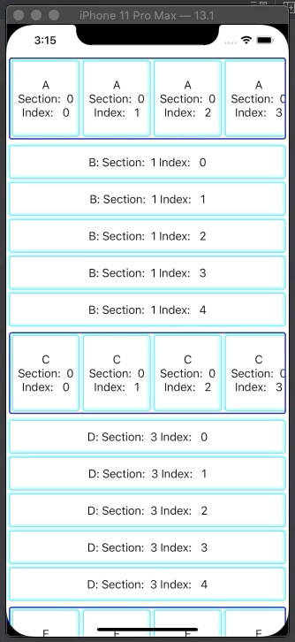

## IGListKitNestedAdapterSample

### Setup

```
brew install xcodegen carthage
carthage bootstrap --platform iOS
```

### Usage

```
xcodegen
open xxx.xcodeproj
```

### Demo



### Requirements

- Swift 5.1
- Xcode 11.1

